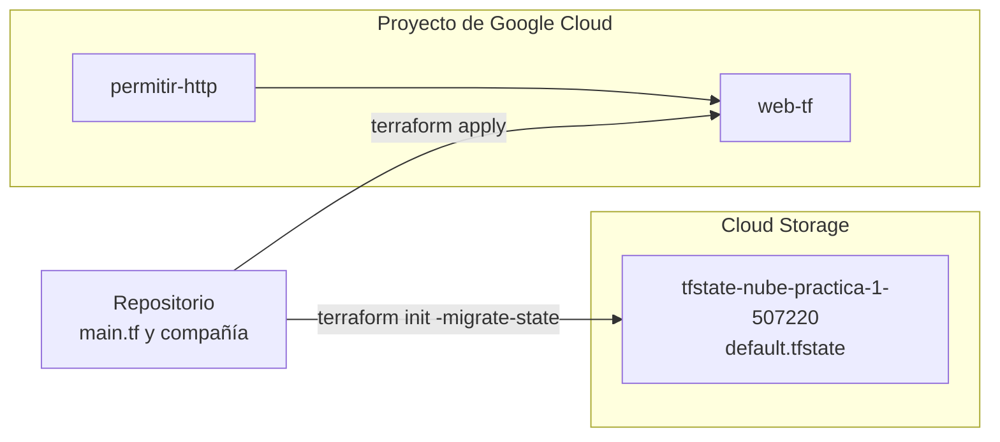

# Práctica 2 NUBE: Terraform
## Angely Sofia Pino Gonzalez – 1152315 Jhan Ávila Torres – 1152490

## Qué se construyó



## Evidencias

### Fase 1. Escribir y aplicar

## Evidencia 1.1:

```
angelysofiapg@cloudshell:~/PRACTICA2 (nube-practica-1-507220)$ terraform plan

```
```
Terraform used the selected providers to generate the following execution plan. Resource actions are indicated with the following
symbols:
  + create

Terraform will perform the following actions:

  # google_compute_firewall.permitir_http will be created
  + resource "google_compute_firewall" "permitir_http" {
      + creation_timestamp = (known after apply)
      + deletion_policy    = "DELETE"
      + destination_ranges = (known after apply)
      + direction          = (known after apply)
      + enable_logging     = (known after apply)
      + id                 = (known after apply)
      + name               = "permitir-http"
      + network            = "default"
      + priority           = 1000
      + project            = "<507220>"
      + self_link          = (known after apply)
      + source_ranges      = [
          + "0.0.0.0/0",
        ]
      + target_tags        = [
          + "servidor-web",
        ]

      + allow {
          + ports    = [
              + "80",
            ]
          + protocol = "tcp"
        }
    }

  # google_compute_instance.web will be created
  + resource "google_compute_instance" "web" {
      + can_ip_forward          = false
      + cpu_platform            = (known after apply)
      + creation_timestamp      = (known after apply)
      + current_status          = (known after apply)
      + deletion_policy         = "DELETE"
      + deletion_protection     = false
      + effective_labels        = {
          + "goog-terraform-provisioned" = "true"
        }
      + id                      = (known after apply)
      + instance_id             = (known after apply)
      + label_fingerprint       = (known after apply)
      + machine_type            = "e2-micro"
      + metadata_fingerprint    = (known after apply)
      + metadata_startup_script = <<-EOT
            #!/bin/bash
            apt update && apt install -y nginx
            echo "<h1><identificacion></h1><p>Servida desde Terraform por $(hostname)</p>" > /var/www/html/index.html
        EOT
      + min_cpu_platform        = (known after apply)
      + name                    = "web-tf"
      + project                 = "<507220>"
      + self_link               = (known after apply)
      + tags                    = [
          + "servidor-web",
        ]
      + tags_fingerprint        = (known after apply)
      + terraform_labels        = {
          + "goog-terraform-provisioned" = "true"
        }
      + zone                    = "us-central1-a"

      + boot_disk {
          + auto_delete                = true
          + device_name                = (known after apply)
          + disk_encryption_key_sha256 = (known after apply)
          + guest_os_features          = (known after apply)
          + kms_key_self_link          = (known after apply)
          + mode                       = "READ_WRITE"
          + source                     = (known after apply)

          + initialize_params {
              + architecture           = (known after apply)
              + image                  = "debian-cloud/debian-12"
              + labels                 = (known after apply)
              + provisioned_iops       = (known after apply)
              + provisioned_throughput = (known after apply)
              + resource_policies      = (known after apply)
              + size                   = (known after apply)
              + snapshot               = (known after apply)
              + type                   = (known after apply)
            }
        }

      + network_interface {
          + igmp_query                  = (known after apply)
          + internal_ipv6_prefix_length = (known after apply)
          + ipv6_access_type            = (known after apply)
          + ipv6_address                = (known after apply)
          + name                        = (known after apply)
          + network                     = "default"
          + network_attachment          = (known after apply)
          + network_ip                  = (known after apply)
          + parent_nic_name             = (known after apply)
          + stack_type                  = (known after apply)
          + subnetwork                  = (known after apply)
          + subnetwork_project          = (known after apply)

          + access_config {
              + nat_ip       = (known after apply)
              + network_tier = (known after apply)
            }
        }
    }

Plan: 2 to add, 0 to change, 0 to destroy.
```

*Explicación de que hace Terraform plan: primeramente, terraform plan todavía no aplica nada, hasta no darle "terraform apply", con terraform apply compara lo que hay en el código tf, lo que tiene la máquina y el state en terraform.tfstate para generar el plan de acción, segundo, en ese plan de acción nos muestra qué se va a crear, destruir o modificar, en nuestro caso dide 2 to add porque no existía antes, se está creando desde cero*


## EVIDENCIA 1.2: Terraform apply

```
Do you want to perform these actions?
  Terraform will perform the actions described above.
  Only 'yes' will be accepted to approve.

  Enter a value: yes

google_compute_firewall.permitir_http: Creating...
google_compute_instance.web: Creating...
google_compute_firewall.permitir_http: Still creating... [10s elapsed]
google_compute_instance.web: Still creating... [10s elapsed]
google_compute_firewall.permitir_http: Creation complete after 11s [id=projects/nube-practica-1-507220/global/firewalls/permitir-http]
google_compute_instance.web: Still creating... [20s elapsed]
google_compute_instance.web: Creation complete after 28s [id=projects/nube-practica-1-507220/zones/us-central1-a/instances/web-tf]

Apply complete! Resources: 2 added, 0 changed, 0 destroyed.
```

## EVIDENCIA 1.3: Git status

```
angelysofiapg@cloudshell:~/PRACTICA2 (nube-practica-1-507220)$ git status
On branch main
Your branch is up to date with 'origin/main'.

Untracked files:
  (use "git add <file>..." to include in what will be committed)
        .terraform.lock.hcl

nothing added to commit but untracked files present (use "git add" to track)
```


## EVIDENCIA 2: 

### IP:
```
angelysofiapg@cloudshell:~/PRACTICA2 (nube-practica-1-507220)$ terraform output ip_externa
"34.71.41.101"
```

### CURL:
```
angelysofiapg@cloudshell:~/PRACTICA2 (nube-practica-1-507220)$  curl -m 8 http://$(terraform output -raw ip_externa)
<h1><identificacion></h1><p>Servida desde Terraform por web-tf</p>
angelysofiapg@cloudshell:~/PRACTICA2 (nube-practica-1-507220)$ 
```

## EVIDENCIA 3: 

### TERRAFORM APPLY: 

```
angelysofiapg@cloudshell:~/PRACTICA2 (nube-practica-1-507220)$ terraform apply
google_compute_firewall.permitir_http: Refreshing state... [id=projects/nube-practica-1-507220/global/firewalls/permitir-http]
google_compute_instance.web: Refreshing state... [id=projects/nube-practica-1-507220/zones/us-central1-a/instances/web-tf]

No changes. Your infrastructure matches the configuration.

Terraform has compared your real infrastructure against your configuration and found no differences, so no changes are needed.

Apply complete! Resources: 0 added, 0 changed, 0 destroyed.

Outputs:

ip_externa = "34.71.41.101"
```

### GCLOUD COMPUTE INSTANCES ADD-TAGS  WEB TF
```
angelysofiapg@cloudshell:~/PRACTICA2 (nube-practica-1-507220)$ gcloud compute instances add-tags web-tf --tags=prueba-manual
Did you mean zone [us-east1-b] for instance: [web-tf] (Y/n)?  n

No zone specified. Using zone [us-central1-a] for instance: [web-tf].
Updated [https://www.googleapis.com/compute/v1/projects/nube-practica-1-507220/zones/us-central1-a/instances/web-tf].
```

### TERRAFORM PLAN: 
```
angelysofiapg@cloudshell:~/PRACTICA2 (nube-practica-1-507220)$  terraform plan
google_compute_firewall.permitir_http: Refreshing state... [id=projects/nube-practica-1-507220/global/firewalls/permitir-http]
google_compute_instance.web: Refreshing state... [id=projects/nube-practica-1-507220/zones/us-central1-a/instances/web-tf]

Terraform used the selected providers to generate the following execution plan. Resource actions are indicated with the following symbols:
  ~ update in-place

Terraform will perform the following actions:

  # google_compute_instance.web will be updated in-place
  ~ resource "google_compute_instance" "web" {
        id                      = "projects/nube-practica-1-507220/zones/us-central1-a/instances/web-tf"
        name                    = "web-tf"
      ~ tags                    = [
          - "prueba-manual",
            "servidor-web",
        ]
        # (21 unchanged attributes hidden)

        # (4 unchanged blocks hidden)
    }

Plan: 0 to add, 1 to change, 0 to destroy.
```

## EVIDENCIA 4: 
```
angelysofiapg@cloudshell:~/PRACTICA2 (nube-practica-1-507220)$ terraform apply -var tipo_maquina=e2-small
google_compute_firewall.permitir_http: Refreshing state... [id=projects/nube-practica-1-507220/global/firewalls/permitir-http]
google_compute_instance.web: Refreshing state... [id=projects/nube-practica-1-507220/zones/us-central1-a/instances/web-tf]

Terraform used the selected providers to generate the following execution plan. Resource actions are indicated with the following symbols:
  ~ update in-place

Terraform will perform the following actions:

  # google_compute_instance.web will be updated in-place
  ~ resource "google_compute_instance" "web" {
        id                      = "projects/nube-practica-1-507220/zones/us-central1-a/instances/web-tf"
      ~ machine_type            = "e2-micro" -> "e2-small"
        name                    = "web-tf"
        tags                    = [
            "servidor-web",
        ]
        # (20 unchanged attributes hidden)

        # (4 unchanged blocks hidden)
    }

Plan: 0 to add, 1 to change, 0 to destroy.

Do you want to perform these actions?
  Terraform will perform the actions described above.
  Only 'yes' will be accepted to approve.

  Enter a value: yes
```

**Aquí el error:**
```
google_compute_instance.web: Modifying... [id=projects/nube-practica-1-507220/zones/us-central1-a/instances/web-tf]
╷
│ Error: Changing the machine_type, min_cpu_platform, service_account, enable_display, shielded_instance_config, scheduling.node_affinities, scheduling.max_run_duration or network_interface.[#d].(network/subnetwork/subnetwork_project) or advanced_machine_features on a started instance requires stopping it. To acknowledge this, please set allow_stopping_for_update = true in your config. You can also stop it by setting desired_status = "TERMINATED", but the instance will not be restarted after the update.
│ 
│   with google_compute_instance.web,
│   on main.tf line 29, in resource "google_compute_instance" "web":
│   29: resource "google_compute_instance" "web" {
```

## Evidencia 5: 
### 5.1 Terraform destroy: 
```
angelysofiapg@cloudshell:~/PRACTICA2 (nube-practica-1-507220)$ time terraform destroy -auto-approve
Destroy complete! Resources: 2 destroyed.
```
### 5.2 Terraform Apply
```
angelysofiapg@cloudshell:~/PRACTICA2 (nube-practica-1-507220)$ time terraform apply -auto-approve
```
```
real    0m25.827s
user    0m5.658s
sys     0m0.854s
Apply complete! Resources: 2 added, 0 changed, 0 destroyed.

Outputs:

ip_externa = "34.71.75.158"
```
```
real    0m41.088s
user    0m4.818s
sys     0m0.606s
```

### 5.3 Comparativa con la practica 1

| Cómo | Tiempo |
|---|---|
| Interfaz gráfica (Práctica 1, fase 1) | 2 minutos (estimado) | 
| `gcloud` (Práctica 1, fase 5) | `real 0m18.098s` |
| Terraform (hoy) | `real 0m41.088s` | 


## Evidencia 6: 
 
### Terraform state list (leído desde el bucket):
```
jhan_4_fran_t@cloudshell:~/PRACTICA2 (nube-practica-1-507220)$ terraform state list
google_compute_firewall.permitir_http
google_compute_instance.web
```
 
### Gcloud storage ls:
```
jhan_4_fran_t@cloudshell:~/PRACTICA2 (nube-practica-1-507220)$ gcloud storage ls gs://tfstate-nube-practica-1-507220/practica-2/
gs://tfstate-nube-practica-1-507220/practica-2/default.tfstate
```
 
### Terraform plan (No changes):
```
jhan_4_fran_t@cloudshell:~/PRACTICA2 (nube-practica-1-507220)$ terraform plan
google_compute_firewall.permitir_http: Refreshing state... [id=projects/nube-practica-1-507220/global/firewalls/permitir-http]
google_compute_instance.web: Refreshing state... [id=projects/nube-practica-1-507220/zones/us-central1-a/instances/web-tf]
 
No changes. Your infrastructure matches the configuration.
 
Terraform has compared your real infrastructure against your configuration and found no differences, so no changes are needed.
```
 
## Evidencia 7: 
 
### Terraform destroy:
```
<< FALTA: pega aquí la salida completa de "terraform destroy", desde que pide confirmar con "yes" hasta "Destroy complete! Resources: 2 destroyed." >>
```
 
### Terraform state list (vacío):
```
jhan_4_fran_t@cloudshell:~/PRACTICA2 (nube-practica-1-507220)$ terraform state list
```
 
### Listas de gcloud (vacías):
```
jhan_4_fran_t@cloudshell:~/PRACTICA2 (nube-practica-1-507220)$ gcloud compute instances list
Listed 0 items.
jhan_4_fran_t@cloudshell:~/PRACTICA2 (nube-practica-1-507220)$ gcloud compute disks list
Listed 0 items.
jhan_4_fran_t@cloudshell:~/PRACTICA2 (nube-practica-1-507220)$ gcloud compute addresses list
Listed 0 items.
jhan_4_fran_t@cloudshell:~/PRACTICA2 (nube-practica-1-507220)$ gcloud compute firewall-rules list --filter="name=permitir-http"
 
To show all fields of the firewall, please show in JSON format: --format=json
To show all fields in table format, please see the examples in --help.
```
 
### Git log --oneline:
```
jhan_4_fran_t@cloudshell:~/PRACTICA2 (nube-practica-1-507220)$ git pull
Already up to date.
jhan_4_fran_t@cloudshell:~/PRACTICA2 (nube-practica-1-507220)$ git log --oneline
10bf5b6 (HEAD -> main, origin/main, origin/HEAD) Evidencia 6
1e358c6 Limpiar main.tf removiendo los comentarios de evidencia
0ced9c2 Estado en Cloud Storage
80b69c0 acomodando formato para que se vea más bonito :3
097a905 .
11e7013 "Variables y autorización para apagar la máquina
d203255 add:   allow_stopping_for_update = true
0f93092 .
d964f49 .
db13924 .
2260882 evidencia 3
751b9d0 add outpus.tf
a492173 Máquina y regla de cortafuegos en Terraform
1f4d195 .
46f296d id
bec429f .
bba0d4d correccion
f84b024 id
996fe83 id del proyecto
b1493c2 Añadir main.tf
6165011 Añadir arranque.ssh
888b2f0 Inicializar repositorio
```
 
### Informe de facturación:
Captura guardada en `evidencias/Evidencia 7.png`.
 
## Respuestas breves
 
### 1. Si en la fase 3 se hubiera creado a mano una máquina web-manual en vez de una etiqueta, ¿qué habría propuesto terraform plan? ¿Y qué habría hecho terraform destroy?
 
Nada, en los dos casos. Terraform no compara el código contra "todo lo que existe en el proyecto"; compara el código contra su estado, y el estado contra la realidad. `web-manual` no está declarada en ningún `.tf` ni tiene una entrada en `terraform.tfstate`, así que para Terraform simplemente no existe: es invisible, no un error ni una diferencia. `terraform plan` no diría nada sobre ella, y `terraform destroy` tampoco la tocaría, porque destroy solo elimina lo que aparece en el estado. Es distinto del caso de la etiqueta manual de la evidencia 3: ahí la deriva ocurrió sobre un recurso que ya estaba en el estado (`web-tf`), así que Terraform sí tenía con qué comparar el atributo `tags`. Una máquina nueva creada por fuera nunca entra en esa comparación porque no hay ninguna entrada de estado que la represente; sobreviviría indefinidamente hasta que alguien la borre a mano o la traiga al estado con `terraform import`.
 
### 2. ¿Por qué el bucket del estado no está en main.tf? ¿Qué pasaría si se destruyera estando declarado ahí?
 
Es un problema de dependencia circular: para que Terraform guarde el estado de una operación necesita un lugar donde escribirlo antes de ejecutar esa operación. Si el bucket estuviera declarado como recurso en el mismo `main.tf` que lo usa como backend, la primera vez que se corriera `terraform apply` no habría ningún bucket todavía donde guardar el estado que registra la creación de ese mismo bucket. Por eso se crea una sola vez a mano, fuera de Terraform. Si el bucket sí estuviera declarado y alguien ejecutara `terraform destroy`, Terraform destruiría también el bucket, porque destroy elimina todo lo que hay en el estado, y ese bucket es precisamente donde vive el archivo de estado que la operación está usando en ese momento: se estaría borrando el almacenamiento del propio proceso mientras el proceso todavía lo necesita para terminar de registrar qué se destruyó. El resultado más probable es un estado corrupto o inaccesible y un backend roto que ya no se puede leer en el siguiente `init`.
 
### 3. Con los precios de lista de la calculadora de Google Cloud, ¿cuánto costaría un mes encendida, cuánto costó durante la práctica, y qué sigue costando después del destroy?
 
*(Para este punto conviene meter los datos reales del proyecto en la [calculadora oficial de Google Cloud](https://cloud.google.com/products/calculator): una `e2-micro` en `us-central1` con disco de arranque estándar, y el tiempo real que estuvo encendida según las evidencias 5 y 7.)* Un mes completo con esa máquina encendida ronda unos pocos dólares al precio de lista sin descuentos, aunque `e2-micro` en `us-central1` está dentro del nivel siempre gratuito de Google (una instancia al mes, con condiciones), así que en un proyecto nuevo el costo real puede terminar en $0. Durante la práctica la máquina estuvo encendida apenas los minutos que duraron los `apply`/`destroy` de las evidencias, muy por debajo de un mes completo: el costo real es prácticamente cero. El único recurso que sigue existiendo después del `destroy` es el bucket de Cloud Storage con `default.tfstate`; un archivo de unos pocos kilobytes en Standard Storage cuesta una fracción de centavo al mes, así que no es perceptible en la factura. Se conserva a propósito: es el punto de partida (el estado y el bucket) para la próxima práctica.